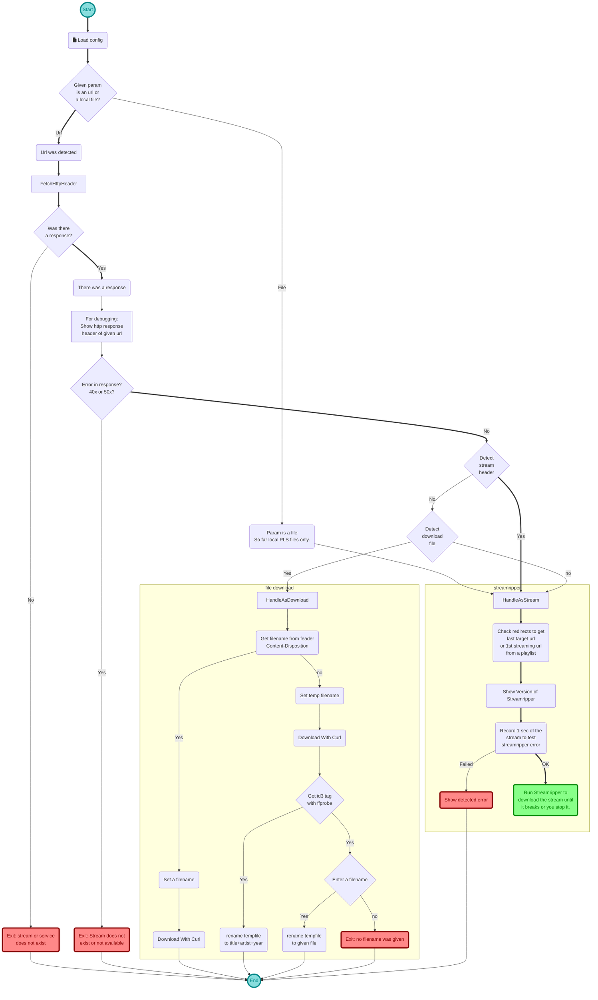

# Record helper script for Streamtuner 2

This script contains some logic to download different streaming types in Streamtuner 2 with streamripper.

👤 Author: Axel Hahn \
📄 Source: <https://github.com/axelhahn/st2_record_helper> \
📜 License: GNU GPL 3.0

Links to related products:

* **Streamtuner 2**: internet radio directory browser <https://sourceforge.net/projects/streamtuner2/> 
* **Streamripper**: record streams as mp3 to your hard drive <https://streamripper.sourceforge.net/>

## Why

I was a bit frustrated: why does nothing happen if I press [Record] in Streamripper 2?!
So it was my challenge: show something what happens or show an error that I am able to read and to analyze.

If this was done I saw why a few streams do not start to donload.
Do I need to fetch a real stream first by following "location:" or grep the 1st line of a m3u playlist.

With the different station plugins exist several constellations. This script is an initial point and not feature complete yet.


## Installation

### Get the files

Extract archive or better: git clone the repository somewhere. If you use git clone it is easier to update all files.

I used `/home/axel/scripts/st2_record_helper/`.

```txt
cd ~/scripts
git clone https://github.com/axelhahn/st2_record_helper.git
```

### Create config

In the subdir `./config/` is a file "default.dist". Copy it to "default" (without .dist).

**Remark**:
If your user has write permissions in the config directory it will be done automatically on the first run of a record call.

### Configure Streamtuner 2

In Streamtuner2 press F12 for settings. In the record section for `audio/*` set

`konsole -e /home/axel/scripts/st2_record_helper/record_helper.sh`
or
`gnome-terminal -- /home/axel/scripts/st2_record_helper/record_helper.sh`

## Requirements

* Bash
* curl
* ffmpeg (to fetch id3 tags in Jamendo tracks)
* streamripper

It was tested on Linux only.

## Features

* You get output! Which stream was requested, http headers for details. 
* on error: a window does not just close - you have 60 sec to read it
* automatic fetching for a real streaming url in some playlist types
* support for the download of files (Jamendo, MODarchive) with automatic renaming
* additional script for cleanup of streamripper output directories

## Update

If you used git clone to install:

```txt
cd ~/scripts/st2_record_helper
git pull
```
Otherwise extract the archive over existing files.

Both variants don't modify your custom configuration.

## Supported downloads

### Stream file donwloads

* **shoutcast + icecast streams**<br>Streamripper will be used to download each single file
* playlist **m3u** will be fetched to grep the first stream in it. That one will be put to streamripper.
* playlist **mpegurl** will be fetched to grep the first stream in it. That one will be put to streamripper.
* playlist **pls** can be handled directly by streamripper.

### Single file donwloads

Single file downloads will be handled by `curl`.

* **Jamendo**: tracks - mp3 single files<br>downloaded files will be renamed to "TITLE - ARTIST (YEAR).mp3" by using `ffprobe` (which is part of ffmpeg package)
* **MODArchiv**: mod, it, s3m, xm<br>the name of the target file is taken from http reponse header - value `filename` in field `Content-Disposition:`

### Tested ST2 channel plugins

The following list gives you a general  overview about tested channel plugins. 

**Remarks**:
- In each type of plugin - even if it is marked as functional - can be some radiostations that do not work.
- Because of internal handling for local downloads and fetching urls you can download more station in this early version already compared to configuring the download with a streamripper binary directly.

In alphabetic order:

* ✅ **filtermusic** direct streaming urls (Icecast)
* ✅ **Internet-Radio** PLS playlist via http(s)
* 🔶 **Jamendo**<br>
  * ◻️ radios
  * ◻️ playlists
  * ◻️ albums
  * ✅ track - download of a single file with curl including automatic renaming
* ✅ **LiveRadio** direct streaming urls
* ✅ **MODarchive** download of a single file with curl; the name of the target file will be detected from `Content-Disposition:`
* ✅ **MyOggRadio** PLS playlist in local /tmp directory
* ✅ **RadioBrowser** direct streaming urls (Icecast)
* ◻️ **reddit** not supported; videos will be shown in VLC
* ✅ **Shoutcast** PLS playlist via http(s)
* ✅ **SomaFM** PLS playlist via http(s)
* ✅ **Streema** direct streaming urls (Icecast)
* ✅ **Surfmusic** M3U playlist via http(s) - 1st sreaming url in it will be used
* ✅ **TuneIn** audio/x-mpegurl playlist via http(s) - 1st sreaming url in it will be used
* ✅ **UbuntuUsers** 
  * ✅ M3U Playlist
  * ✅ direct streaming urls (Icecast)
* ✅ **Xiph.org** direct streaming urls (Icecast)

## Known errors

* **error -9 [SR_ERROR_PARSE_FAILURE]** 
  The streaming url cannot be parsed. Maybe there is a wrong or unencoded character in it.

* **error -28 [SR_ERROR_INVALID_METADATA]**
  This is a bug in streamripper: t tries to request metadata in protocol version http/1.1 - but streamripper can understand http 1.0 only.

## How does it work?

I started to draw the processing of the recording script using Mermaid.


Damn why did I start it?!