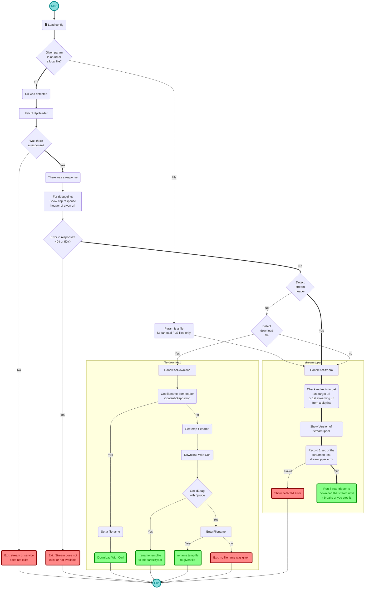

## How does it work?

I started to draw the processing of the recording script using Mermaid.

```mermaid
graph TD

  %% ------------------------------------------------------------
  %% elements
  %% ------------------------------------------------------------
  Start((Start))
  End((End))

  LoadCfg(fa:fa-file Load config)
  UrlOrFile{Given param<br>is an url or<br>a local file?}
  
  ParamIsAFile(Param is a file<br>So far local PLS files only.)
  ParamIsAUrl(Url was detected)

  FetchHttpHeader
  GotResponse{Was there<br>a response?}
  noResponse(Exit: stream or service<br>does not exist)
  yesResponse(There was a response)
  ShowHttpHeader[For debugging:<br>Show http response<br>header of given url]

  ErrorResponse{Error in response?<br>404 or 50x?}
  YesErrorResponse(Exit: Stream does not<br>exist or not available)

  DetectedStream{Detect<br>stream<br>header}
  DetectedDownload{Detect<br>download<br>file}

  subgraph streamripper
    HandleAsStream
    CheckStreamUrl(Check redirects to get<br>last target url<br>or 1st streaming url<br>from a playlist)
    SRshowVersion(Show Version of Streamripper)
    SRrecordTest(Record 1 sec of the<br>stream to test<br> streamripper error)
    SRrecordTestFailed(Show detected error)
    SRStart(Run Streamripper to<br>download the stream until<br>it breaks or you stop it.)
  end

  subgraph file download
    HandleAsDownload
    fileGetfilenameFromHeader(Get filename from feader<br>Content-Disposition)
    setFile1(Set a filename)
    setFileTemp(Set temp filename)
    DownloadWithCurl1(Download With Curl)
    DownloadWithCurl(Download With Curl)
    fileGetfilenameFromFile{Get id3 tag<br>with ffprobe}
    setFile2(rename tempfile<br>to title+artist+year)
    EnterFilename
    setFile3(rename tempfile<br>to given file)
    NoFilename(Exit: no filename was given)
  end

  %% ------------------------------------------------------------
  %% styles
  %% ------------------------------------------------------------

  style Start              fill:#8dd,stroke:#088,color:#088,stroke-width:4px
  style End                fill:#8dd,stroke:#088,color:#088,stroke-width:4px

  style DownloadWithCurl1  fill:#8f8,stroke:#080,color:#080,stroke-width:4px
  style setFile2           fill:#8f8,stroke:#080,color:#080,stroke-width:4px
  style setFile3           fill:#8f8,stroke:#080,color:#080,stroke-width:4px
  style SRStart            fill:#8f8,stroke:#080,color:#080,stroke-width:4px

  style noResponse         fill:#f88,stroke:#800,color:#800,stroke-width:4px
  style YesErrorResponse   fill:#f88,stroke:#800,color:#800,stroke-width:4px
  style NoFilename         fill:#f88,stroke:#800,color:#800,stroke-width:4px
  style SRrecordTestFailed fill:#f88,stroke:#800,color:#800,stroke-width:4px

  %% ------------------------------------------------------------
  %% graphs
  %% ------------------------------------------------------------

  Start==>LoadCfg==>UrlOrFile
  UrlOrFile-->|File|ParamIsAFile --> HandleAsStream
  UrlOrFile==>|Url|ParamIsAUrl

  ParamIsAUrl ==> FetchHttpHeader ==> GotResponse

  GotResponse --> |No|noResponse--> End
  GotResponse ==> |Yes|yesResponse --> ShowHttpHeader --> ErrorResponse
  ErrorResponse --> |Yes|YesErrorResponse --> End
  ErrorResponse ==> |No|DetectedStream
  DetectedStream ==> |Yes| HandleAsStream
  DetectedStream --> |No| DetectedDownload

  DetectedDownload --> |Yes| HandleAsDownload
  DetectedDownload --> |no| HandleAsStream


  HandleAsDownload --> fileGetfilenameFromHeader
  fileGetfilenameFromHeader --> |Yes|setFile1 --> DownloadWithCurl1 --> End
  fileGetfilenameFromHeader 
    --> |no|setFileTemp 
    --> DownloadWithCurl 
    --> fileGetfilenameFromFile 
    fileGetfilenameFromFile --> |Yes|setFile2 --> End
    fileGetfilenameFromFile --> |Yes|EnterFilename

    EnterFilename --> |Yes| setFile3 --> End
    EnterFilename --> |no| NoFilename --> End
  
  HandleAsStream 
    ==> CheckStreamUrl
    ==> SRshowVersion
    ==> SRrecordTest
  SRrecordTest --> |Failed| SRrecordTestFailed --> End
  SRrecordTest ==> |OK| SRStart
```
Damn why did I start it?!