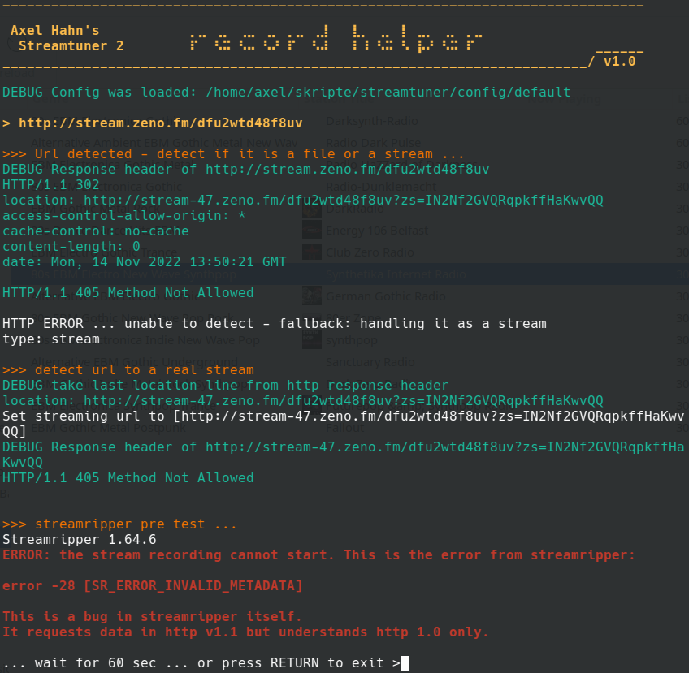
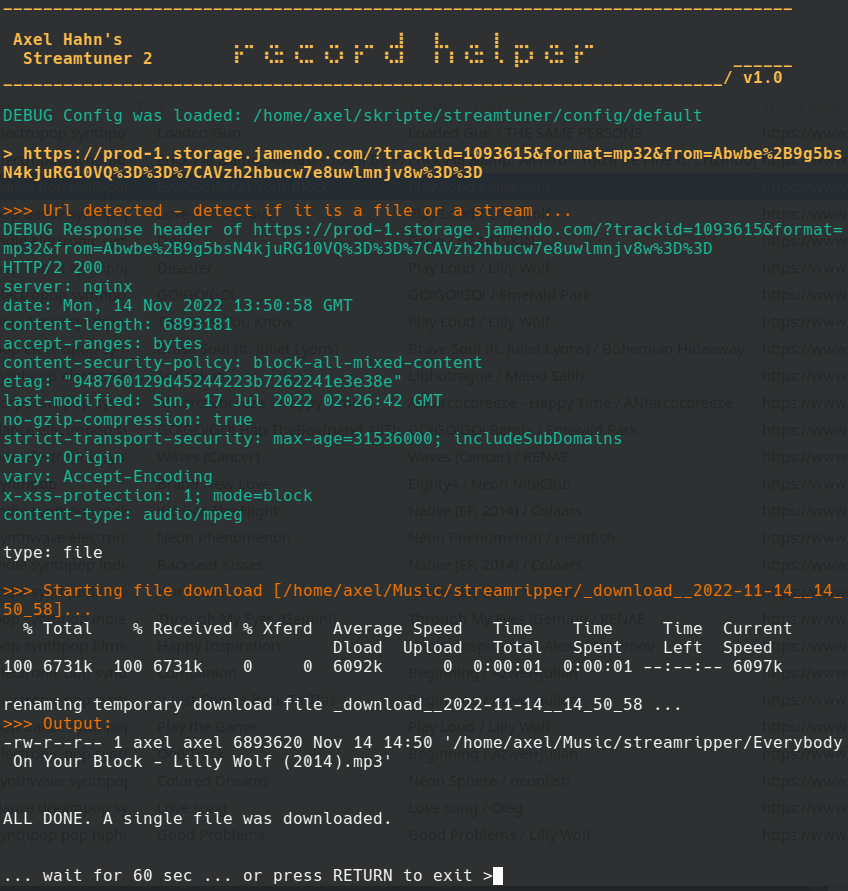

# Record helper script for Streamtuner 2

This bash script contains some logic to download different streaming types in Streamtuner 2 with Streamripper.

👤 Author: Axel Hahn \
📄 Source: <https://github.com/axelhahn/st2_record_helper> \
📜 License: GNU GPL 3.0 \
📗 Docs: <https://www.axel-hahn.de/docs/st2_record_helper/>

Links to related products:

* **Streamtuner 2**: internet radio directory browser <https://sourceforge.net/projects/streamtuner2/> 
* **Streamripper**: record streams as mp3 to your hard drive <https://streamripper.sourceforge.net/>

## Why

I was a bit frustrated: why does nothing happen if I press [Record] in Streamripper 2?!
So it was my challenge: show something what happens or show an error that I am able to read and to analyze.

If this was done I saw why a few streams do not start to donload.
Do I need to fetch a real stream first by following "location:" or grep the 1st line of a m3u playlist.

With the different station plugins exist several constellations. This script is an initial point and not feature complete yet.

## Features

* You get output! Which stream was requested, http headers for details. 
* on error: a window does not just close - you have 60 sec to read it
* automatic fetching for a real streaming url in some playlist types
* support for the download of files (Jamendo, MODarchive) with automatic renaming
* remove unused streamripper output directories and cleanup of 'incomlete' dirs
* command line parameter support

## More screenshots

### Stop on error

If any error occours before the download starts you get a few debug infos about the http header.
On exist the script waits that you are able to read the output.

### Donwload files

Next to streamripper I detect single foles for mp3 or tracker files (.mod, .it, .st3).
If a file was found it will be downloaded.

